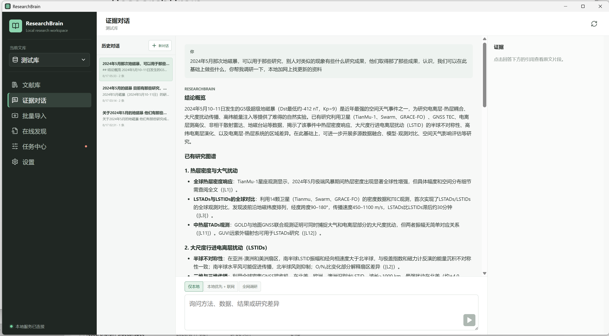
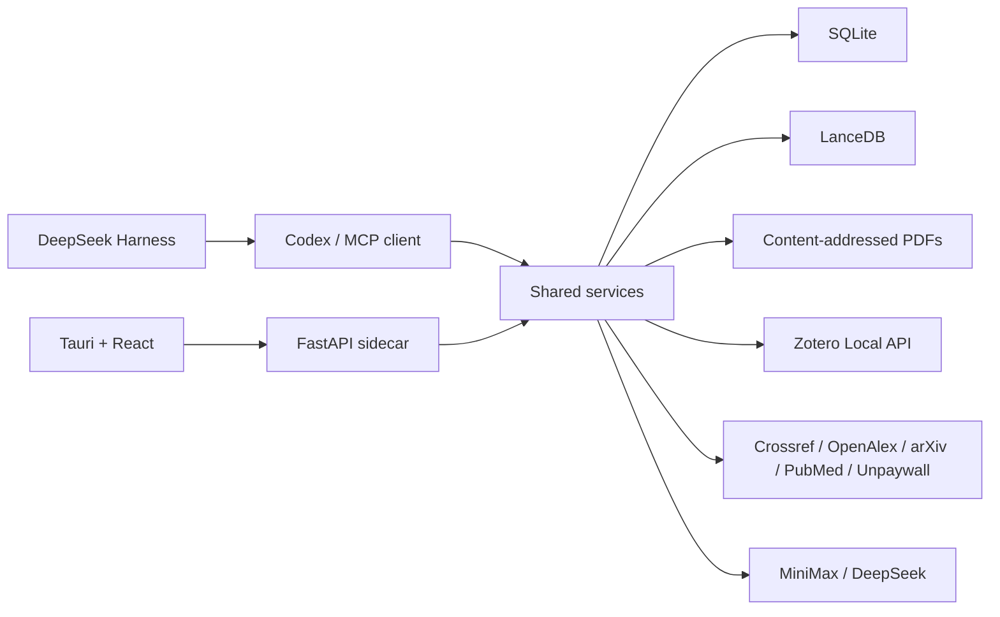

# ResearchBrain

[English](README.en.md) | 简体中文


ResearchBrain 是面向 Windows 的本地优先科研知识工作台，围绕文献的发现、采集、管理、阅读、
解析、检索、调研和引用，提供从原始资料到可追溯研究结论的一体化工作流。

它既可以增量镜像 Zotero 中的题录、集合、标签和 PDF，也可以通过 DOI 批量导入以及 Crossref、
OpenAlex、arXiv、PubMed 等来源发现文献，并从合规的开放来源获取全文。导入后的文献按 DOI 等
标识去重，PDF 可直接阅读，并由 MinerU 或 PyMuPDF 转换为带页码和章节定位的 Markdown；题录、
摘要和全文分别向量化后，可用于本地检索、本地优先的联网补充和全网调研。每次回答均保留原文
证据、页码或在线出处，网上发现的文献可以继续导入文库，历史会话能够恢复，参考文献可导出为
CSL-JSON、BibTeX、RIS、DOI 清单或 Markdown，也可通过 MCP 交给 Codex 等客户端调用。

题录、PDF、解析产物、向量索引和对话记录默认保存在本机；只有在用户启用在线发现或调用
MiniMax、DeepSeek 时才会发送相应请求。应用可在 Windows 11 上独立运行，不依赖 WSL、gbrain、
Docker 或 PostgreSQL。

> 当前为 `0.1.9 alpha`。核心研究闭环可运行，但还不是 Zotero 的完整替代品。



## 核心能力

- **本地文献库**：独立文库或 Zotero 只读镜像；按 Zotero library version 增量同步题录、作者、
  集合、标签和 PDF 附件，并分别显示摘要向量与 PDF 全文向量状态。
- **身份与增量判定**：以规范化 DOI/PMCID/PMID/arXiv 标识文献，以 SHA-256 标识 PDF；明确区分
  只有题录、摘要已索引、PDF 已保存、PDF 已解析和全文已索引五种状态。
- **文献采集**：批量 DOI、Crossref 元数据、Crossref/OpenAlex/arXiv/PubMed 在线发现、多标识符去重，也可导入无 DOI 记录。
- **合法全文**：通过 Unpaywall、OpenAlex、PMC 和带开放许可的 Crossref 链接定位 PDF，也会从已确认开放的落地页提取 PDF；候选失败时自动回退，并支持手工附加 PDF。
- **PDF 解析**：MinerU 优先、PyMuPDF 回退，输出 Markdown、结构化 JSON、页码、章节和图表位置。
- **本地检索**：MiniMax `embo-01` 同时向量化题录、摘要和 PDF 全文，LanceDB 提供全文、向量与
  RRF 融合排序；空文库也会返回明确的就绪状态说明。
- **证据问答**：支持“仅本地”“本地优先 + 联网”“全网调研”；DeepSeek 只能引用提供的本地或在线证据 ID。
- **连续对话**：按文库永久保存全部会话、消息和引用并可恢复；当前问题检索权重为 `1.0`，最近问题的上下文检索权重为 `0.25`，历史模型回答只用于理解上下文，证据权重始终为 `0`。
- **Scholar 补充**：可将检索式直接交给浏览器中的 Google Scholar，避免依赖不稳定的页面抓取。
- **文献导出**：CSL-JSON、BibTeX、RIS、DOI 清单和 Markdown。
- **Agent 接入**：FastAPI、CLI、桌面应用和 stdio MCP 共用同一 SQLite 与 LanceDB 数据。
- **Harness 深度调研（实验分支）**：可启动隔离的 DeepSeek Harness Web Profile，通过 MCP 调用
  ResearchBrain 的本地检索、联网发现、DOI 导入、开放全文和任务状态工具，并按科研 Skill 执行多步调研。

## 设计边界

- Zotero 镜像是单向只读，不写回 `zotero.sqlite`、附件或集合。
- Zotero Desktop Local API 不提供删除记录端点；新增、修改和新增/替换 PDF 会增量同步，Zotero 中
  已删除的条目当前不会自动从镜像删除。
- 自动全文获取不集成 Sci-Hub、LibGen 或任何付费墙绕过服务。
- PDF、题录、向量库和聊天记录默认留在本机；调用 MiniMax/DeepSeek 时，相关文本会发送给所选服务商。
- 基础安装包不包含 MinerU 模型。未配置 MinerU 时自动使用 PyMuPDF。
- `0.1.x` 不包含高级题录编辑、复杂重复项交互合并、PDF 批注或团队协作。

详见[隐私与安全边界](docs/privacy-and-security.md)和[许可说明](docs/licensing.md)。

## 架构



架构决策、进程模型和数据所有权见[架构文档](docs/architecture.md)。

## 从源码运行

### 前置条件

- Windows 11 x64
- Python 3.11
- Node.js 20
- Rust stable MSVC
- Visual Studio C++ Build Tools、WebView2 和 PowerShell 7 或 Windows PowerShell
- 推荐安装 [uv](https://docs.astral.sh/uv/)

```powershell
git clone git@github.com:cacity/ResearchBrain.git
cd ResearchBrain

uv venv --python 3.11
uv sync --all-extras --group dev
$env:PYTHONPATH = "src"
.\.venv\Scripts\python.exe -m researchbrain.cli init

cd desktop
npm ci
npm run tauri dev
```

只启动本地 API 和浏览器前端：

```powershell
$env:PYTHONPATH = "src"
.\.venv\Scripts\python.exe -m researchbrain.cli serve
cd desktop
npm run dev
```

生产桌面版会随机选择 loopback 端口并生成 256 位会话令牌；开发 API 默认使用
`127.0.0.1:8765`，Vite 默认使用 `127.0.0.1:1420`。

## 首次配置

1. 在“设置”中填写用于 Crossref、Unpaywall、OpenAlex 和 PubMed 的联系邮箱。
2. 可选填写 NCBI 与 OpenAlex API Key，以获得更稳定的在线检索额度。
3. 确认 Zotero 数据目录，例如 `%USERPROFILE%\Zotero`，并在 Zotero 中启用本地 API。
4. 将 MiniMax 和 DeepSeek 密钥保存到 Windows Credential Manager。
5. 可选：安装 MinerU，在“设置 > 文档解析”填写 `mineru.exe` 完整路径。
6. 创建“Zotero 只读镜像”文库，点击“检测 Zotero”，再执行首次同步；以后点击“增量同步”只处理
   library version 水位之后新增或修改的题录和 PDF。
7. 在同步统计中查看新增题录、PDF、缺失附件、解析和向量数量；“任务”页面可批量重试失败任务。

默认数据目录为 `%LOCALAPPDATA%\ResearchBrain`：

```text
ResearchBrain/
  config/settings.json       # 不含密钥的设置
  data/library.sqlite        # 题录、任务、对话和出处
  data/lancedb/              # 可重建检索索引
  library/objects/           # SHA-256 内容寻址 PDF
  artifacts/                 # Markdown、JSON 和图表产物
  runtime/                   # 可回滚外部组件
```

## Codex 与 MCP

安装桌面版后，在“设置 > Codex”点击“注册 MCP”，新建 Codex 任务即可调用：

- `list_libraries`
- `get_research_context`
- `library_status`
- `get_item`
- `search_library`
- `ask_library`
- `search_online`
- `import_dois`
- `queue_fulltext`
- `item_status`
- `sync_zotero`
- `attach_local_pdf`
- `queue_library_index`
- `list_jobs`
- `export_references`

源码环境也可以运行：

```powershell
.\scripts\register_codex_mcp.ps1
codex.cmd mcp list
```

### Codex Skills

仓库提供五个可组合 Skill，分别负责 Zotero 增量同步、DOI/开放全文获取、PDF 解析、向量索引和
基于证据的调研。数据管道仍由 ResearchBrain 管理，调研综合由 Codex 直接读取检索证据后完成，
不再默认转交给内置问答模型。

```powershell
powershell.exe -NoProfile -ExecutionPolicy Bypass -File .\scripts\install_codex_skills.ps1
```

重启 Codex 后生效。详细职责和后续独立仓库边界见 [Codex Skills 说明](docs/skills.md)。

## DeepSeek Harness 实验分支

`feature/deepseek-harness` 提供完整的官方 Harness Web Profile，而不是在 ResearchBrain 中重新实现
一套智能体循环。在“深度调研”中点击“安装环境”，应用会检测 Node.js；低于 `22.19` 时下载并校验
官方 Node 24 便携版，再安装固定版本的 DSH 和 ResearchBrain MCP Bundle。启动后从页面打开 Harness
工作台，当前文库会作为默认研究上下文。

Harness 使用 `%LOCALAPPDATA%\ResearchBrain\harness` 下的隔离工作区和配置目录，不直接获得数据库、
PDF 对象目录或 Zotero 目录的文件权限。文献导入和全文获取只能通过有副作用标记的 MCP 工具排队，
解析和向量化是否完成以任务状态为准。

详细安装、数据边界、调试和回退方式见 [DeepSeek Harness 集成说明](docs/deepseek-harness.md)。

## 测试与构建

```powershell
.\.venv\Scripts\python.exe -m ruff format --check --no-cache src tests scripts
.\.venv\Scripts\python.exe -m ruff check --no-cache src tests scripts
.\.venv\Scripts\python.exe -m pytest -p no:cacheprovider
cd desktop
npm run typecheck
npm run format:check
```

Windows 安装包：

```powershell
.\scripts\build_release.ps1
```

完整开发、测试和发布流程见[开发指南](docs/development.md)、[发布指南](docs/releasing.md)和
[GitHub 发布检查表](docs/github-publishing-checklist.md)。

## 仓库结构

```text
src/researchbrain/       Python 业务核心、API、CLI 和 MCP
desktop/src/             React/TypeScript 桌面界面
desktop/src-tauri/       Rust/Tauri 宿主和 sidecar 生命周期
src/researchbrain/migrations/  Alembic 数据库迁移
tests/                   Python 自动化测试
scripts/                 构建、注册、冒烟和视觉检查脚本
docs/                    架构、隐私、许可、路线图和开发文档
.github/                 CI、依赖更新和协作模板
```

## 参与贡献

提交问题前请先阅读[贡献指南](CONTRIBUTING.md)、[支持说明](SUPPORT.md)和
[安全政策](SECURITY.md)。不要上传私人 PDF、Zotero 数据库、API key、浏览器 cookie 或包含个人路径的日志。

## 许可证

项目以 [GNU Affero General Public License v3.0 only](LICENSE) 发布。PyMuPDF、MinerU 及其他第三方
组件保留各自许可证；分发安装包前必须阅读[第三方许可说明](docs/licensing.md)。
