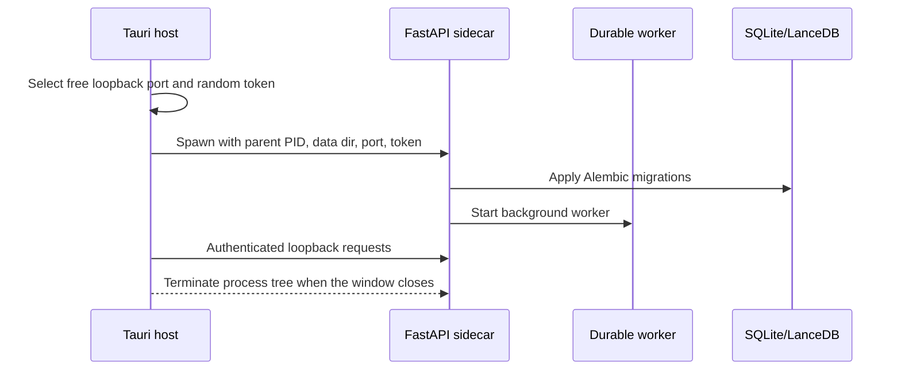

# Architecture

## Goals

ResearchBrain is a single-user, local-first Windows application. SQLite is the transactional source of truth,
LanceDB is a rebuildable retrieval index, and content-addressed storage keeps source PDFs immutable and
auditable. The Python service owns business behavior so the desktop UI, CLI, tests, and MCP do not implement
separate document pipelines.

## Process model

The HTTP server binds to `127.0.0.1`. The desktop host generates two UUID-derived token values for every
launch and injects the token into both the sidecar and renderer configuration. The Python sidecar watches the
parent PID; Tauri also terminates the process tree on window destruction.

## Data flow

1. DOI or Zotero import creates normalized `Item`, creator, identifier, collection, tag, provenance, and
   attachment records in SQLite.
2. A durable job resolves lawful full-text candidates and stores validated PDFs by SHA-256.
3. MinerU or PyMuPDF emits versioned Markdown and JSON artifacts with page mappings.
4. Stable chunks are embedded through MiniMax and written to LanceDB with index/model metadata.
5. Search performs keyword and vector retrieval, combines ranks with RRF, and returns evidence locations.
6. DeepSeek receives only the selected evidence and must return an allow-listed set of citation IDs.

## Research orchestration

The V2 research path uses a bounded action loop rather than a single retrieval-augmented prompt. DeepSeek
selects one schema-validated `AgentAction` at each controller boundary. The host then enforces the phase
allow-list, tool schema, library scope, network policy, approval state, idempotency key, and remaining budget.
Only `ResearchToolRegistry` can create a `ToolResultMessage`; model output cannot fabricate tool observations.

A run persists its intent, bilingual source-specific query plan, evidence ledger, coverage matrix, claims,
review findings, tool calls, stop decisions, and event stream. Phase checkpoints additionally persist counters,
recent tool-result context, draft, and review state. A retry restores the latest safe checkpoint and skips
completed intake, planning, and retrieval work. Read-only calls are reusable; write calls still require valid
approval and idempotency checks.

Parallel scouts are restricted subagents. Each receives one subquestion, a bounded context, an independent
step/tool budget, and a read-only allow-list. Its tool observations are fed into a subsequent model turn, and
the parent accepts only evidence identifiers already present in the current ledger.

## Ownership boundaries

- `src/researchbrain/db`: schema and migrations.
- `library`: normalized records and metadata provenance.
- `fulltext`: lawful discovery, URL policy, validation, and object storage.
- `documents`: parser adapters and versioned artifacts.
- `retrieval`: chunking, embedding provider, LanceDB, and hybrid ranking.
- `agent`: evidence prompt, answer validation, and citations.
- `jobs`: idempotent durable workflow and retry policy.
- `zotero`: Local API and constrained attachment copy.
- `api`, `cli`, `mcp_server`, and `tools`: interfaces over shared services.

## Persistence

The default data root is `%LOCALAPPDATA%\ResearchBrain`. User content is intentionally outside the install
directory, so uninstalling the application does not silently delete a library. SQLite uses WAL mode. LanceDB
is derived state and can be rebuilt from document artifacts; source PDFs and parsed artifacts are keyed by
content hash and parser/index version.

## Literature identity and coverage states

`Identifier` is the external identity registry. A work receives a deterministic canonical key using the first
available identifier in this order: DOI, PMCID, PMID, arXiv, then the internal item UUID. DOI values are
normalized before lookup. The canonical key groups duplicate Zotero records without forcing them into one row,
so separate Zotero attachment relationships remain intact.

PDF identity is independent from work identity. Every stored PDF has a SHA-256 hash; identical bytes share the
content-addressed object even when attached to multiple records. Parsed artifacts are keyed by attachment,
source hash, parser, and parser version. Metadata and full-text embeddings keep their own content hash, model,
dimensions, and index version.

The API exposes five ordered coverage states:

1. `metadata_only`: bibliographic metadata exists but has not been indexed.
2. `metadata_indexed`: title and abstract are searchable; no processed PDF is available.
3. `pdf_stored`: a PDF is stored and awaits parsing.
4. `parsed`: Markdown/JSON exists and awaits full-text embedding.
5. `fulltext_indexed`: parsed PDF chunks are searchable in the vector index.

`POST /v1/libraries/{library_id}/items/lookup` accepts a DOI and optional PDF SHA-256. It reports all matching
records, whether that exact PDF is already stored, and the next required action. Unchanged metadata, PDF bytes,
parser output, and embedding versions are reused instead of recomputed.

## External services

Crossref, OpenAlex, arXiv, PubMed, and Unpaywall provide discovery and metadata. MiniMax provides embeddings;
DeepSeek provides generation. Provider clients are isolated adapters so future models can be added without
changing the storage contract.
