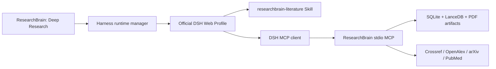

# DeepSeek Harness integration

This document describes the experimental implementation on the
`feature/deepseek-harness` branch. DeepSeek Harness is still a developer preview;
ResearchBrain therefore keeps the integration optional and does not replace its
existing deterministic evidence-chat pipeline.

## Architecture



The desktop application remains responsible for the library and background-job
worker. Harness owns planning, tool selection, session execution, permissions,
and its Web UI. The boundary is the official MCP client plugin.

## Installation

1. Check out `feature/deepseek-harness` and run ResearchBrain normally.
2. Select the target library.
3. Open **Deep Research** and choose **Install runtime**.
4. After the profile reports configured, choose **Start** and **Open workspace**.
5. Configure the model in Harness if the DeepSeek credential inherited from
   ResearchBrain is not sufficient for the selected model route.

ResearchBrain pins `@deepseek-ai/dsh@0.1.1-rc.2`. Harness requires Node.js
`22.19` or newer. On Windows x64, the installer downloads the latest Node 24 ZIP
from `nodejs.org`, verifies its SHA-256 against the official
`SHASUMS256.txt`, and activates it under the local ResearchBrain runtime
directory. Set `RESEARCHBRAIN_NODE_DIST_URL` only when an organization operates
a trusted mirror with the same Node distribution layout.

Runtime data is isolated under:

```text
%LOCALAPPDATA%/ResearchBrain/harness/
  dsh-home/                         Harness profile, settings, and sessions
  researchbrain-harness-bridge/     generated MCP bundle
  workspace/.agents/skills/         ResearchBrain literature Skill
  harness.log                       startup and runtime log
```

## MCP tools

Read-only tools:

- `get_research_context`
- `list_libraries`
- `library_status`
- `get_item`
- `item_status`
- `search_library`
- `ask_library`
- `search_online`
- `list_jobs`
- `export_references`

Queued write tools:

- `import_dois`
- `queue_fulltext`
- `sync_zotero`
- `attach_local_pdf`
- `queue_library_index`

The write tools do not report work as complete when they only create a queue
entry. The Skill requires the agent to inspect `list_jobs` before making claims
about PDF acquisition, parsing, or embedding.

## Security boundaries

- Harness binds to loopback and is not exposed to the LAN by ResearchBrain.
- Its workspace does not contain the SQLite database, LanceDB index, PDF object
  store, Zotero directory, or provider credentials. Literature operations are
  mediated by MCP; the selected Harness permission policy still governs any
  general filesystem or shell tools supplied by the upstream Web profile.
- ResearchBrain passes the DeepSeek credential only to the child-process
  environment. It is not written into the generated MCP bundle.
- MCP reads are annotated as read-only. DOI and full-text actions are annotated
  as non-destructive write operations so the active Harness permission policy
  can request approval.
- Automated full-text resolution continues to use lawful open sources only.

## Development checks

```powershell
.\.venv\Scripts\python.exe -m pytest -p no:cacheprovider
.\.venv\Scripts\python.exe -m ruff check --no-cache src tests scripts
cd desktop
npm run build
```

Inspect the effective profile without starting it:

```powershell
$env:DSH_HOME = "$env:LOCALAPPDATA\ResearchBrain\harness\dsh-home"
npx --yes @deepseek-ai/dsh@0.1.1-rc.2 --profile web --dump-config
```

## Stop, remove, or merge

Stopping from ResearchBrain terminates only the process tree started by the
current application instance. An externally started service is shown as
running but is not owned or terminated.

To abandon the experiment, stop Harness and switch back to `main`. Removing
`%LOCALAPPDATA%\ResearchBrain\harness` removes only Harness runtime state; it
does not remove ResearchBrain libraries. Back up Harness sessions before
deleting that directory.

After evaluation, merge with:

```powershell
git switch main
git merge --no-ff feature/deepseek-harness
```

The upstream references are the
[DeepSeek Harness repository](https://github.com/deepseek-ai/deepseek-harness),
[MCP client documentation](https://github.com/deepseek-ai/deepseek-harness/tree/master/packages/mcp/mcp-client),
and [filesystem Skill documentation](https://github.com/deepseek-ai/deepseek-harness/tree/master/packages/skill/skill-filesystem).
