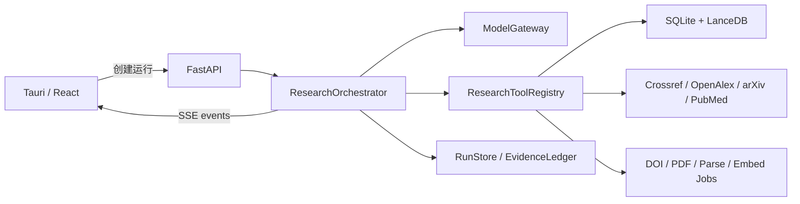

# ResearchBrain 多轮研究编排器实施方案

## 1. 目标

在保留现有文献库、Zotero 同步、DOI/PDF 获取、MinerU/PyMuPDF 解析、MiniMax 向量检索、
在线发现、引用面板、MCP 和 Skills 的基础上，把内置证据问答从固定的“规划一次、检索一次、
生成一次”升级为可观察、可中止、可恢复、可核验的多轮研究流程。

目标不是复刻 Pi 的 coding agent，也不是引入任意 Shell 或文件操作，而是借鉴其状态化 agent
loop、工具事件、上下文压缩、steering 和 reviewer 机制，为科研调研建立受约束的专用编排器。

首个可用版本应解决以下问题：

- 自动拆分复杂问题，并记录每个子问题的覆盖情况。
- 根据首次检索结果判断证据是否充分，不足时自动换词或扩大检索范围。
- 明确区分题录、摘要和全文证据，不用摘要支持图、页码或详细方法结论。
- 最终回答前检查遗漏、矛盾、无效引用和证据越界。
- 通过事件流持续显示执行阶段，不再长时间停留在无反馈状态。
- 支持取消、失败重试、应用重启后的状态恢复和用户中途补充要求。
- 历史对话保留连续性，但历史模型回答的事实证据权重始终为零。

## 2. 范围与边界

### 本次实现

- Python 后端中的专用 `ResearchOrchestrator`。
- DeepSeek 为首个生成模型，保留扩展到其他 OpenAI-compatible 模型的接口。
- 现有 ResearchBrain 工具作为唯一数据访问入口。
- FastAPI SSE 事件流、取消和 steering API。
- Tauri/React 中的阶段进度、工具活动、证据覆盖和错误恢复界面。
- 研究运行、步骤、证据账本和会话摘要的持久化。
- 固定角色的 planner、evidence assessor、synthesizer 和 reviewer。

### 暂不实现

- 不直接嵌入 `@earendil-works/pi-agent-core`。
- 不给模型开放 Shell、任意文件读写、SQL 或任意网络请求。
- 不自动绕过付费墙，也不抓取 Google Scholar 页面。
- 不在第一阶段实现任意第三方 agent 扩展代码执行。
- 不让多个 agent 直接共享无边界的完整上下文。

## 3. 总体架构



核心原则：

1. 编排器只决定下一步调用哪个受控工具，不直接访问数据库、文件系统或互联网。
2. 每个模型输出使用结构化 Schema 校验；失败时只重试该步骤，不重放已完成的写操作。
3. 证据内容和执行状态分开保存；最终引用只能来自本次运行的证据账本。
4. 写操作和只读研究分开授权。DOI 导入、全文下载和附件关联不得由模型静默执行。
5. 运行过程按阶段持久化，SSE 只负责实时传输，不承担唯一状态存储。

## 4. 研究状态机

```text
queued
  -> intake
  -> planning
  -> local_search
  -> evidence_inspection
  -> gap_assessment
       -> local_search       # 换检索式，最多达到预算
       -> online_search      # hybrid/online 或本地证据不足
       -> acquisition_wait   # 用户允许导入且可在预算内完成
       -> synthesis
  -> synthesis
  -> verification
       -> revision           # reviewer 发现可修复问题
       -> completed
  -> completed

任意活动状态 -> cancelling -> cancelled
任意活动状态 -> failed
可恢复错误   -> paused -> 原阶段
```

### 各阶段职责

| 阶段                  | 输入                     | 输出                             | 是否调用模型 |
| --------------------- | ------------------------ | -------------------------------- | -----------: |
| `intake`              | 用户问题、模式、会话记忆 | 规范化任务、限制和语言           |           否 |
| `planning`            | 任务、最近上下文         | 子问题、术语、查询计划、完成标准 |           是 |
| `local_search`        | 查询计划                 | 去重后的本地候选证据             |           否 |
| `evidence_inspection` | 候选证据                 | 文献级摘要、方法/数据/结果槽位   |           是 |
| `gap_assessment`      | 子问题和证据矩阵         | 已覆盖项、缺口、下一动作         |           是 |
| `online_search`       | 缺口查询                 | 在线题录/摘要及来源状态          |           否 |
| `acquisition_wait`    | DOI 和用户策略           | 导入/全文/解析/向量任务状态      |           否 |
| `synthesis`           | 通过筛选的证据包         | 带证据 ID 的 Markdown 初稿       |           是 |
| `verification`        | 初稿、证据账本、问题     | 引用错误、遗漏、越界和矛盾列表   |           是 |
| `revision`            | 初稿、审查问题           | 修订稿和最终引用集合             |           是 |

### 停止条件

同时满足以下条件才允许进入最终输出：

- 所有必答子问题为 `covered` 或明确标记 `insufficient_evidence`。
- 初稿中所有文献事实声明附近存在有效证据 ID。
- 引用 ID 均存在于本次运行的证据账本中。
- 图、表、页码、方程和详细流程结论只由全文证据支持。
- reviewer 未发现阻断级问题；普通问题最多修订一次后进入限制说明。
- 达到预算时停止继续搜索，但必须用已有证据输出受限答案，不能无响应。

## 5. 运行预算

默认使用确定性预算，避免无限循环和费用失控：

| 项目              |       默认值 | 可配置范围 |
| ----------------- | -----------: | ---------: |
| 子问题数          |            6 |       1-10 |
| 本地检索轮数      |            3 |        1-5 |
| 总检索式          |            6 |       1-12 |
| 每个检索式候选数  |           12 |       5-30 |
| 在线来源每次查询  | 4 个来源并行 | 固定白名单 |
| 模型步骤总数      |            6 |       3-10 |
| reviewer 修订轮数 |            1 |        0-2 |
| 工具调用总数      |           30 |      10-60 |
| 单次研究软超时    |       180 秒 |  60-600 秒 |
| 在线导入等待      |        30 秒 |   0-120 秒 |

达到软超时后不丢弃结果，而是转入 `synthesis`，并在限制中写明尚未完成的检索或全文任务。

## 6. 证据账本与权重

### 证据等级

权重只用于候选选择和覆盖度排序，不代表统计概率，也不能绕过证据等级硬规则。

| 等级                  | 示例                        | 选择权重 | 可支持的声明                           |
| --------------------- | --------------------------- | -------: | -------------------------------------- |
| `fulltext_page`       | PDF 解析后的带页码段落      |     1.00 | 数据、方法、结果、图表和页码           |
| `fulltext_section`    | 有章节但页码不完整的全文    |     0.85 | 数据、方法和结果，不声称精确页码       |
| `structured_abstract` | PubMed 或出版社摘要         |     0.60 | 摘要明确陈述的目的、方法概况和主要结果 |
| `metadata`            | 标题、作者、期刊、年份、DOI |     0.20 | 书目信息和研究存在性                   |
| `conversation`        | 历史用户意图和模型回答      |     0.00 | 仅解析指代和保持任务连续性             |

### 硬规则

- 以前的模型回答永远不能作为事实证据。
- 在线摘要不得支持“图 X 显示”“第 X 页”“具体参数为”等全文级声明。
- 同一 DOI 或 PMID 的多个来源合并为一个文献实体，但保留各来源出处。
- 同一文献的多个近邻 chunk 不得挤占全部候选；默认每篇最多保留 3 个互补片段。
- 结果集必须做文献多样性选择，兼顾相关性、证据等级、年份和来源，而不是只取向量最高分。
- 最终 `citation_ids` 只包含回答实际引用的证据，不把所有候选都显示为依据。

### 子问题覆盖矩阵

每个子问题保存以下状态：

```json
{
  "subquestion_id": "Q2",
  "question": "研究使用了哪些数据？",
  "status": "partial",
  "required_level": "fulltext_section",
  "evidence_ids": ["L3", "L7"],
  "missing": ["数据时间范围", "预处理步骤"],
  "next_queries": ["paper title data preprocessing"]
}
```

`gap_assessment` 只能在证据矩阵上做决策，不能凭模型自我感觉宣布“证据充分”。

## 7. 模型层设计

新增抽象接口：

```python
class ModelGateway(Protocol):
    async def generate_structured(
        self,
        role: str,
        system: str,
        messages: list[ModelMessage],
        schema: type[BaseModel],
        signal: CancellationSignal,
    ) -> BaseModel: ...

    async def stream_markdown(
        self,
        system: str,
        messages: list[ModelMessage],
        signal: CancellationSignal,
    ) -> AsyncIterator[str]: ...
```

第一版由 `DeepSeekGateway` 实现，封装现有 `DeepSeekClient`。后续 MiniMax 或其他模型只新增适配器，
编排器不接触供应商 API 格式。

### 固定模型角色

- `planner`：只输出子问题、检索式、证据需求和停止标准。
- `assessor`：只填充覆盖矩阵并决定下一动作，不写最终结论。
- `synthesizer`：只使用筛选后的证据包生成初稿。
- `reviewer`：逐条检查问题覆盖、引用有效性、证据等级和推断边界。
- `reviser`：只能根据 reviewer 问题和原证据修订，不得新增未提供事实。

所有结构化结果使用 Pydantic 校验。JSON 解析失败时，使用错误反馈重试一次；再次失败则保存步骤错误，
根据阶段选择降级输出或终止。不得静默把无效 JSON 当作自然语言继续处理。

## 8. 受控工具层

建立 `ResearchToolRegistry`，复用 `ResearchBrainTools`，但把返回值标准化并标注只读/写入权限。

### 第一阶段只读工具

- `get_research_context`
- `library_status`
- `search_library`
- `get_item`
- `item_status`
- `search_online`
- `list_jobs`

### 用户确认后的写工具

- `import_dois`
- `queue_fulltext`
- `attach_local_pdf`
- `queue_library_index`
- `sync_zotero`

编排器默认不能自动调用写工具。它只能发出 `approval_required` 事件，列出 DOI、目标文库、预期任务
和原因。用户确认后生成不可重复执行的 approval token，写工具使用现有幂等键防止重放。

建议补充两个聚合工具，减少模型循环和 API 开销：

- `search_library_batch(library_id, queries, per_query_limit)`：并行搜索并统一去重。
- `get_evidence_context(item_ids, preferred_sections)`：批量返回题录、状态和互补全文片段。

## 9. 数据库改造

保留 `chat_sessions` 和 `chat_messages`，新增以下表。

### `research_runs`

| 字段                                | 说明                                             |
| ----------------------------------- | ------------------------------------------------ |
| `id`                                | UUID                                             |
| `session_id`                        | 所属聊天会话                                     |
| `user_message_id`                   | 触发本次运行的用户消息                           |
| `assistant_message_id`              | 完成后生成的回答消息，可空                       |
| `mode`                              | local/hybrid/online                              |
| `status`                            | queued/running/paused/completed/failed/cancelled |
| `phase`                             | 当前状态机阶段                                   |
| `question`                          | 本次原始问题                                     |
| `plan`                              | 结构化子问题与查询计划 JSON                      |
| `coverage`                          | 子问题覆盖矩阵 JSON                              |
| `budgets`                           | 本次预算及已用量 JSON                            |
| `limitations`                       | 运行限制 JSON                                    |
| `error_code/error_message`          | 可诊断错误                                       |
| `created_at/updated_at/finished_at` | 时间戳                                           |

### `research_steps`

记录每个阶段及重试，字段包括 `run_id`、`sequence`、`phase`、`attempt`、`status`、`input`、
`output`、`usage`、`started_at`、`finished_at`、`error_code` 和 `error_message`。

### `research_evidence`

保存运行时证据账本，字段包括运行内证据 ID、文献/附件/artifact/chunk ID、在线来源、DOI、URL、
证据等级、标题、片段、章节、页码、检索式、排名、内容哈希、是否入选和是否被最终引用。

唯一约束使用 `(run_id, evidence_fingerprint)`。fingerprint 优先采用本地 `chunk_id`，在线记录采用
规范化 DOI/PMID/arXiv 加摘要哈希。

### `chat_session_memories`

每个会话保存一个可替换的结构化记忆：目标、用户限制、已定义术语、已经证据支持的结论及其文献
标识、未解决问题、摘要覆盖的消息边界和生成时间。它不保存为证据，只用于下一次问题规划。

建议迁移版本为 `202609xx_0007_research_runs.py`，不修改旧消息内容，旧会话可继续读取。

## 10. API 与事件协议

### 新 API

```text
POST /v1/chat/sessions/{session_id}/runs
GET  /v1/research/runs/{run_id}
GET  /v1/research/runs/{run_id}/events
POST /v1/research/runs/{run_id}/cancel
POST /v1/research/runs/{run_id}/steer
POST /v1/research/runs/{run_id}/approvals/{approval_id}
POST /v1/research/runs/{run_id}/retry
```

创建运行立即返回 `202 Accepted` 和 `run_id`。桌面端随后连接 SSE。现有同步消息 API 在过渡期保留，
内部可以调用新编排器并等待完成，便于 MCP 和旧客户端兼容。

### SSE 事件

```json
{"type":"run_started","run_id":"..."}
{"type":"phase_started","phase":"local_search","label":"正在检索本地文库"}
{"type":"tool_started","tool":"search_library","summary":"执行 4 个检索式"}
{"type":"evidence_added","count":8,"fulltext":5,"abstract":3}
{"type":"coverage_updated","covered":3,"partial":2,"missing":1}
{"type":"approval_required","approval_id":"...","action":"import_dois","items":["10..."]}
{"type":"answer_delta","delta":"## 结论"}
{"type":"warning","code":"openalex_unavailable","message":"OpenAlex 本轮不可用"}
{"type":"run_completed","message_id":"..."}
```

事件包含单调递增 `sequence`。客户端重连时传 `Last-Event-ID`，后端先重放持久化的阶段事件，再
继续推送实时事件。文本 delta 不必逐字持久化，最终消息和步骤输出必须持久化。

## 11. 上下文、历史权重与压缩

模型输入由四层组成：

1. 固定证据与安全规则。
2. 当前问题、模式、预算和子问题计划。
3. 会话记忆与最近 4 个完整对话轮次，仅用于意图连续性。
4. 本次运行筛选后的证据包。

压缩触发条件：模型上下文预计超过窗口的 60%，或未压缩会话超过 12 个对话轮次。压缩结果使用
固定结构：目标、约束、术语、已完成调研、待解决问题和关键文献标识。下一次回答仍须重新从
数据库取回原证据，不能直接引用压缩摘要中的模型结论。

Steering 消息分为两类：

- `constraint`：例如“只看最近五年”，在下一阶段前修改计划并废弃不符合条件的候选。
- `follow_up`：例如“再比较中国区数据”，当前运行完成后自动创建关联运行。

第一版只在阶段边界消费 steering，避免工具执行一半时改变写操作参数。

## 12. 在线搜索与全文获取

- `hybrid` 模式必须先检索本地库，再根据覆盖矩阵生成在线查询。
- Crossref、OpenAlex、arXiv 和 PubMed 并行查询，分别记录成功、超时和限流状态。
- 结果按 DOI、PMID、arXiv ID 和规范化标题去重；同一记录保留最完整摘要和所有来源。
- Google Scholar 继续采用浏览器跳转，不作为自动抓取提供者。
- 在线结果可以进入本次证据账本，但只有题录或摘要时必须显示相应证据等级。
- 发现 DOI 后先查询本地唯一标识；已存在时复用，不重复导入。
- 用户批准导入后走现有 DOI、开放全文、解析和向量任务链。
- 任务在等待预算内完成时重新检索新全文；未完成则用现有摘要生成临时结论，并在答案中列出待完成任务。

## 13. Reviewer 规则

Reviewer 输出结构化问题列表，而不是重新自由写一篇答案：

```json
{
  "blocking": [
    {
      "type": "evidence_level_violation",
      "claim": "图 3 显示……",
      "citation_ids": ["W2"],
      "reason": "W2 只有在线摘要"
    }
  ],
  "warnings": [],
  "missing_subquestions": ["Q4"],
  "valid_citation_ids": ["L1", "L3"]
}
```

代码层先做确定性校验：引用 ID 存在、证据等级、DOI 格式、引用是否被实际使用。模型 reviewer 只
处理语义支持关系、遗漏和矛盾。确定性错误必须修正；模型审查意见最多触发一次修订，防止循环。

## 14. 桌面端交互

聊天中增加紧凑的运行状态区，不新增独立的大卡片页面：

- 输入区保留“仅本地 / 本地优先 + 联网 / 全网调研”。
- 发送后立即显示当前阶段、耗时、已找到文献数和全文证据数。
- 展开“执行详情”可查看检索式、数据源状态和覆盖矩阵。
- 生成正文时流式渲染 Markdown。
- 发送按钮在运行时变为停止图标；停止后保留已获得证据并生成“继续调研”入口。
- 用户批准 DOI 导入时使用明确的模态窗口，显示 DOI、目标文库和可能触发的任务。
- 右侧证据面板继续独立滚动，新增证据等级、来源、命中检索式和“为何引用”字段。
- 应用重启后，运行中的任务显示为“已中断，可恢复”，而不是永久转圈。

## 15. 并发、恢复与错误处理

- 同一会话最多一个活动研究运行，避免上下文顺序冲突。
- 默认全局最多两个运行；检索提供者内部使用有界并发。
- 每个模型调用和工具调用都接收取消信号。
- 只读步骤可自动重试，指数退避并带抖动；鉴权错误不重试。
- 写工具依赖幂等键，恢复时查询已有 Job，不重复导入或下载。
- 单个在线来源失败不终止整个运行，记录 provider status 后继续。
- DeepSeek 失败且已有证据时返回结构化的失败说明和证据列表；无证据时仍返回可见的就绪建议。
- 应用启动时把 `running` 且无活动 worker 的运行标记为 `paused`，由用户恢复或系统按配置恢复。

## 16. 安全边界

- 工具注册表采用显式白名单，模型不能构造任意函数名。
- 联网只允许现有学术来源和全文解析器认可的域名/协议。
- 外部摘要、PDF 文本和网页内容统一标记为不可信数据，不允许其中的指令改变系统规则。
- API Key 继续保存在 Windows Credential Manager，不写入运行步骤、事件和日志。
- SSE、取消、steering 和 approval API 继续使用本地随机会话令牌。
- 默认不自动执行 DOI 导入、全文下载和文库写入；用户可在设置中选择“始终询问”或“允许开放全文自动入库”。
- 日志只记录工具、状态、耗时和错误码，不记录完整密钥、Authorization header 或不必要的全文。

## 17. 分阶段实施

### Phase 0：基线与契约，已实现

- 建立 20-30 个本地、混合和空文库问题的黄金测试集。
- 保存当前回答、引用、耗时、模型调用次数和人工评分。
- 定义 Pydantic Schema、状态机转换和事件协议。
- 增加 `research_loop_v2` feature flag；Phase 3 完成后默认启用，环境变量可回退旧 API。

交付：基线报告、Schema、状态机单元测试和功能开关。

### Phase 1：多轮只读研究循环，已实现

- 新增 `orchestration/` 包和 `ModelGateway`。
- 实现 planning、批量本地检索、证据账本、覆盖矩阵和 gap assessment。
- 支持 hybrid/online 补检索及预算停止。
- 实现 synthesis、确定性引用检查、reviewer 和一次 revision。
- 暂用非流式最终返回，先验证回答质量。

交付：API 可通过 feature flag 调用 V2，旧问答路径仍可回退。

### Phase 2：持久化和实时界面，已实现

- 增加三张研究表和会话记忆表迁移。
- 实现创建运行、查询状态、SSE、取消和恢复。
- 桌面端增加阶段状态、停止按钮和流式 Markdown。
- 保证右侧证据面板独立滚动。

交付：用户可看见全过程，关闭并重开应用后可查看或恢复运行。

### Phase 3：受控导入和全文回填，已实现

- 实现 approval 事件和一次性授权。
- 串接 DOI 去重、开放全文、解析、向量任务。
- 在等待预算内轮询 Job，完成后把新全文加入当前运行。
- 未及时完成时生成受限答案并保留后续继续入口。

交付：在线发现到本地全文证据形成完整但受控的闭环。

### Phase 4：长会话与模型可靠性，已实现

- 实现结构化会话记忆和自动 compaction。
- 加入超时、限流、结构化输出修复和供应商错误分类。
- 为第二模型适配器预留接口，但不要求首版提供自动跨供应商切换。
- 增加 steering 和 follow-up 队列。

交付：长对话、失败重试和中途补充要求稳定可用。

### Phase 5：受控 Subagent，已实现但默认关闭

- planner 可并行派发 2-4 个只读 scout，分别处理不同子问题或来源。
- 每个 scout 只得到任务片段、预算和只读工具，不得到写权限。
- aggregator 只接收结构化证据包，不接收未经裁剪的全部过程文本。
- reviewer 独立于 synthesizer，避免同一上下文自我确认。

交付：复杂综述的覆盖率提升；若 A/B 测试收益不明显，保持关闭。

Phase 0-4 已在 `feature/pi-research-orchestrator` 实现。Phase 5 通过
`RESEARCHBRAIN_PARALLEL_SCOUTS=1` 启用，仍需使用固定质量集独立评估收益，不作为默认能力。

## 18. 建议目录和代码落点

```text
src/researchbrain/
  orchestration/
    models.py           # Run、Plan、Coverage、Review Schema
    state_machine.py    # 合法转换和预算
    orchestrator.py     # 主循环
    evidence.py         # EvidenceLedger 和等级规则
    context.py          # 会话记忆与压缩
    events.py           # 事件类型与事件存储
    tools.py            # 受控工具适配层
    reviewer.py         # 确定性校验
  agent/
    gateway.py          # ModelGateway
    deepseek.py         # DeepSeek 适配与兼容旧客户端
  api/
    research_runs.py    # 运行、SSE、取消、steering、approval
desktop/src/
  features/research-run/
    RunProgress.tsx
    CoverageDetails.tsx
    ApprovalDialog.tsx
    useResearchRun.ts
tests/
  test_orchestrator.py
  test_evidence_ledger.py
  test_research_runs_api.py
  test_context_compaction.py
```

## 19. 测试矩阵

### 单元测试

- 状态机拒绝非法跳转和超预算循环。
- 证据 fingerprint、DOI 去重、等级和文献多样性选择。
- 覆盖矩阵不能被无证据的模型字段标记为完成。
- 引用 ID、证据等级和未引用候选的确定性检查。
- compaction 不把历史回答提升为证据。
- 取消信号、steering 队列和 retry 分类。

### 集成测试

- 本地全文足够时不联网。
- 本地不足的 hybrid 问题会执行在线补检索。
- 所有在线来源失败时仍返回本地受限答案。
- 空文库 local 模式立即给可见说明。
- DOI 已存在时不重复导入；写操作恢复不重复创建 Job。
- PDF 在等待期完成解析后被加入同一运行证据。
- DeepSeek 返回无效 JSON、超时、401、429 和空回答时行为可诊断。
- SSE 重连、取消和应用重启恢复。

### 前端测试

- 运行状态不会挤压消息或右侧证据区域。
- Markdown 流式更新时不出现原始标记泄漏。
- 证据面板独立滚动，引用按钮键盘可达。
- approval 对话框明确显示写入内容，取消不会创建任务。
- 失败、暂停和取消均有可见终态。

### 可选真实服务烟雾测试

- 使用专门测试文库和低预算执行 DeepSeek、MiniMax、Crossref、OpenAlex、arXiv 和 PubMed。
- 不在普通 CI 中要求真实密钥；GitHub Actions 继续使用 mock/fixture。

## 20. 质量指标与验收标准

使用 Phase 0 黄金集对 V1 和 V2 盲评：

| 指标                       |                    首版验收目标 |
| -------------------------- | ------------------------------: |
| 引用 ID 有效率             |                            100% |
| 全文等级越界错误           |                               0 |
| 空证据可见反馈             |                            100% |
| 子问题覆盖率               |            相对 V1 提升至少 20% |
| 人工判定“引用支持声明”比例 |                      不低于 90% |
| 首个进度事件               |               本地启动后 1 秒内 |
| 取消生效                   | 2 秒内进入 cancelled/cancelling |
| 应用重启后运行可诊断       |                            100% |
| DOI/PDF 写操作重复执行     |                               0 |

同时记录总耗时、模型调用次数、输入/输出 token、在线调用次数、全文证据比例和 reviewer 修订原因。
质量提升必须通过固定问题集对比确认，不能只凭单次回答观感判断。

## 21. 分支、提交和发布策略

从当前 `feature/deepseek-harness` 创建：

```powershell
git switch -c feature/pi-research-orchestrator
```

建议按以下边界提交：

1. `test: add research answer quality baseline`
2. `feat: add research run schemas and state machine`
3. `feat: add iterative evidence orchestrator`
4. `feat: persist research runs and stream events`
5. `feat: show research progress and cancellation`
6. `feat: add controlled DOI acquisition approvals`
7. `feat: compact research session context`
8. `test: add orchestrator integration and recovery coverage`

V2 已在 Phase 3 完成后设为默认；`RESEARCHBRAIN_RESEARCH_LOOP_V2=0` 可关闭新运行入口，原有同步
消息 API 保留一个发布周期用于诊断和回退。运行记录使用追加迁移，不改写旧消息。

## 22. 第一迭代的完成定义

以下第一迭代完成定义均已由自动化测试覆盖：

- 不修改 Zotero、PDF、向量和任务队列的数据所有权。
- V1 与 V2 可通过 feature flag 并存。
- 一个复杂问题至少能执行“计划、两轮检索、缺口判断、综合、审查”完整路径。
- 每个子问题有明确覆盖状态和证据 ID。
- reviewer 能拦截虚构 ID、摘要冒充全文和漏答子问题。
- 达到预算或外部服务失败时仍返回有边界说明的结果。
- 新增测试全部通过，原有 Python、前端和 Rust 检查不回归。
- 黄金集显示覆盖率提升，且不存在引用正确性下降。

SSE/UI、受控全文回填、恢复、steering 和可选 scout 已继续实现。真实服务下相对 V1 的回答质量收益
仍应通过 `evaluation/research_quality_cases.json` 盲评，不以单次回答替代验收。
